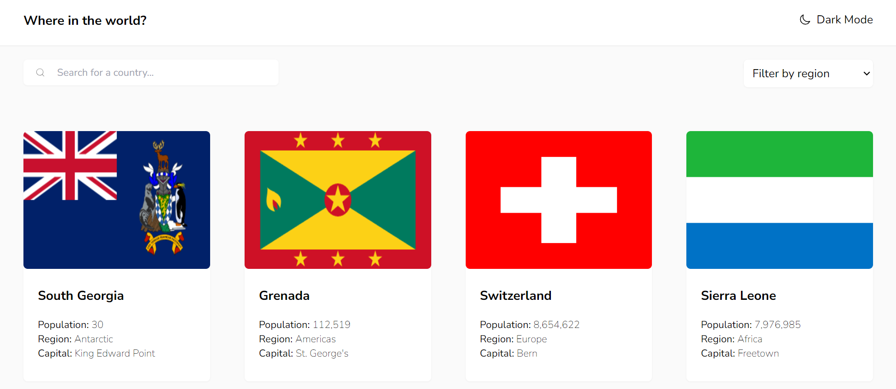

# COUNTRIES APP

An app integrated with the REST Countries API to pull country data.

The users are able to:

- See all countries from the API on the homepage
- Search for a country using an `input` field
- Filter countries by region
- Click on a country to see more detailed information on a separate page
- Click through to the border countries on the detail page
- Toggle the color scheme between light and dark mode

## Table of contents

- [Screenshot](#screenshot)
- [Links](#links)
- [Built with](#built-with)

# Screenshot

# Links

- github URL: https://github.com/MercySitienei/countries-app
- live site URL: https://mercysitienei.github.io/countries-app/

# Built with

- React.js
- Vite
- Semantic HTML5 markup
- CSS custom properties
- Flexbox
- CSS Grid
- Mobile-first workflow
- JavaScript
